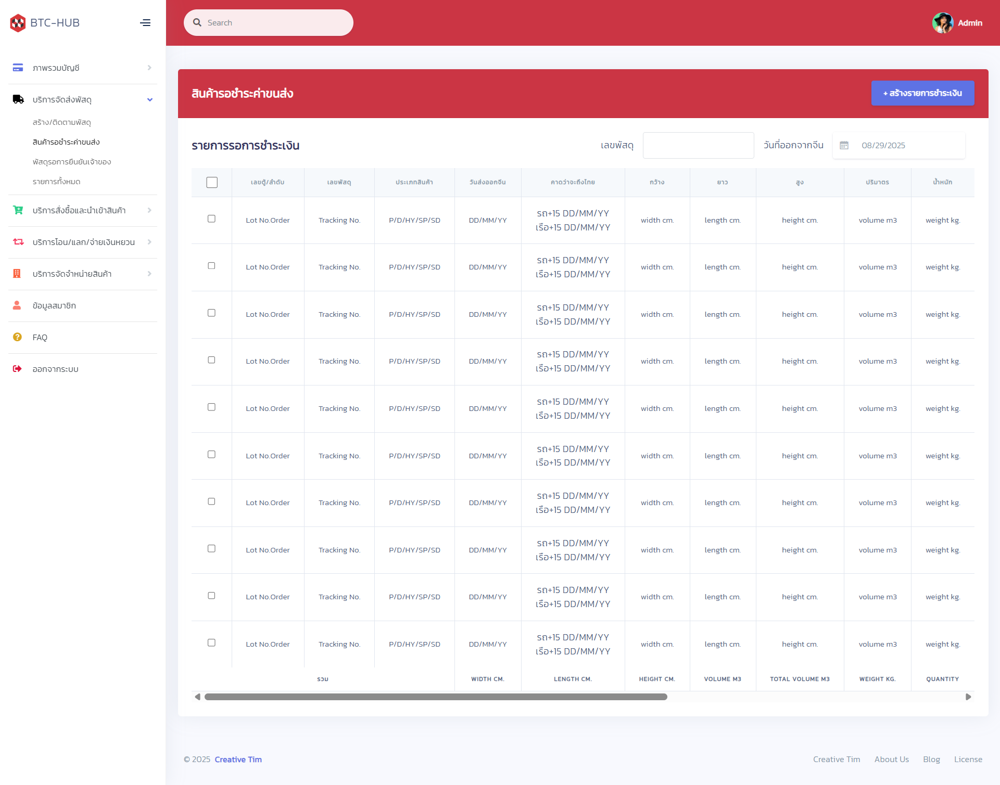

# BTC Cargo - Freight Management System

A dynamic and modern frontend for a **Freight Management and Tracking System** built with Angular. This Single-Page Application (SPA) provides a complete user interface for managing logistics operations, including order processing, shipment tracking, and business analytics.

---

<p align="center">
  <a href="https://raw.githubusercontent.com/nithasp/btc-cargo/master/screenshots/sc2.png" target="_blank">
    
  </a>
</p>

---

## Features

-   **Dashboard Overview:** A central hub displaying key performance indicators (KPIs) like total orders, delivered shipments, and revenue, providing an at-a-glance view of business health.
-   **Comprehensive Order Management:** Full CRUD (Create, Read, Update, Delete) functionality for managing the entire lifecycle of cargo orders through an intuitive and responsive interface.
-   **Interactive Shipment Tracking:** A dedicated tracking feature that allows users to search for orders and monitor their status through a clear, visual pipeline, simulating real-world logistics stages from "Booked" to "In Transit" to "Delivered."

## Tech Stack

-   **Framework:** Angular
-   **Language:** TypeScript
-   **State Management:** RxJS Observables & Angular Services
-   **Routing:** Angular Router
-   **Styling:** CSS3
-   **Build Tool:** Angular CLI

## Installation & Setup

Follow these steps to get the development environment running on your local machine.

### Prerequisites

-   Ensure you have **Node.js** (which includes npm) installed on your system.
-   Ensure you have the **Angular CLI** installed globally.
    ```bash
    npm install -g @angular/cli
    ```

### Installation Steps

1.  **Clone the repository:**
    ```bash
    git clone https://github.com/nithasp/btc-cargo.git
    cd btc-cargo
    ```

2.  **Install all required dependencies:**
    ```bash
    npm install
    ```

3.  **Run the development server:**
    ```bash
    ng serve
    ```
    # or use the npm script
    ```bash
    npm start
    ```

4.  **Open your browser:**
    Navigate to `http://localhost:4200`. The application will automatically reload if you change any source file.
